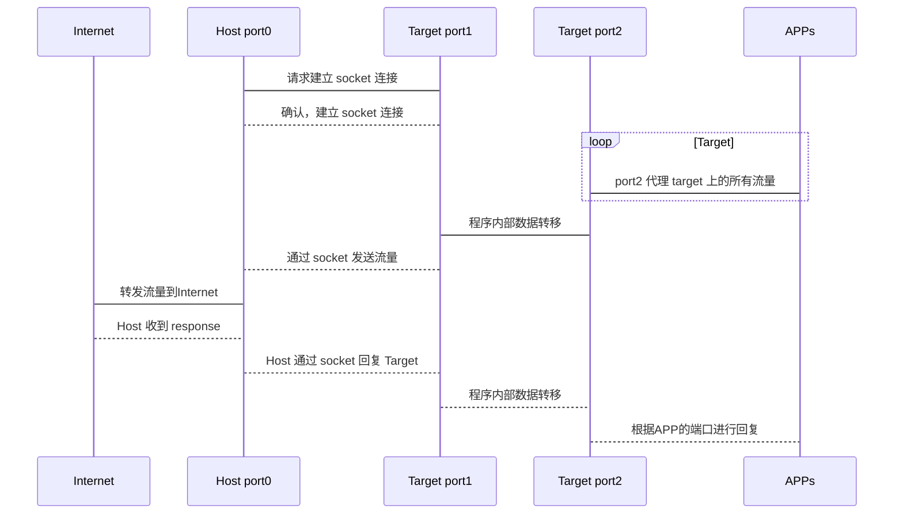

```mermaid
sequenceDiagram
    participant Internet
    participant Host port0
    participant Target port1
    participant Target port2
    participant APPs
    Host port0 -> Target port1: 请求建立 socket 连接
    Target port1 --> Host port0: 确认，建立 socket 连接
    loop Target
        APPs -> Target port2: port2 代理 target 上的所有流量
    end
    Target port2 -> Target port1: 程序内部数据转移
    Target port1 --> Host port0: 通过 socket 发送流量
    Host port0 -> Internet: 转发流量到Internet
    Internet --> Host port0: Host 收到 response
    Host port0 --> Target port1: Host 通过 socket 回复 Target
    Target port1 --> Target port2: 程序内部数据转移
    Target port2 --> APPs: 根据APP的端口进行回复
```
